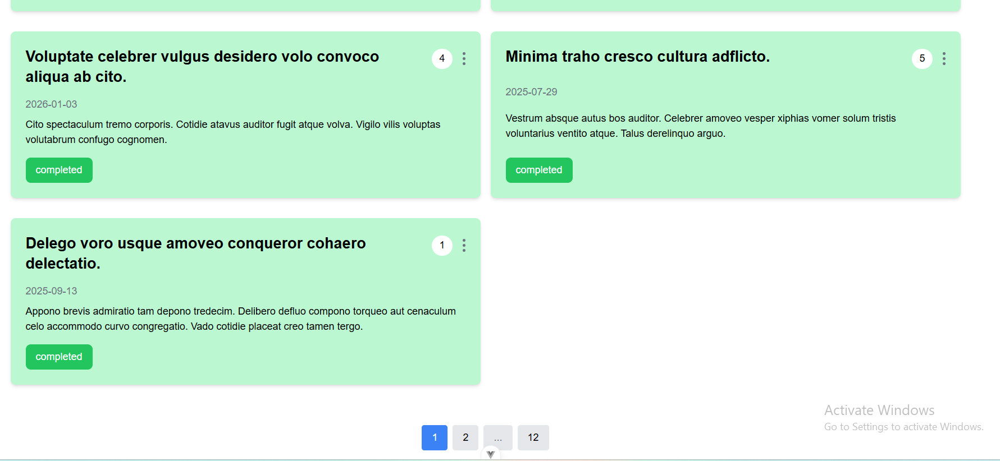
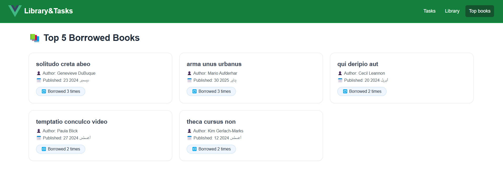
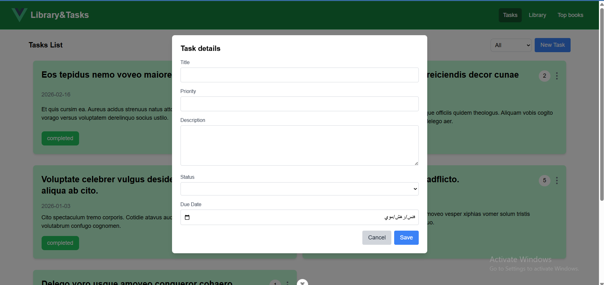

# Frontend
### Tech Stack
- Vue 3
- axios
- tailwindcss
- vue-router
- pinia

### Features
- Home
  <br/>
  
- Add loan
  <br/>
  
- Edit loan
  <br/>
  
- Delete loan
  <br/>
   
- Filter loan
  <br/>
  
- responsive design
  <br/>
  
- pagination
  <br/>
  
- Top borrowed books
  <br/>
  
- Add task
  <br/>
  

## Project Setup
- environment variables
  - create a file named `.env` in the root directory and add the following variables:
```bash
VITE_API_URL = "http://localhost:8000/"
```

```sh
npm install
```

### Compile and Hot-Reload for Development

```sh
npm run dev
```

### Compile and Minify for Production

```sh
npm run build
```
