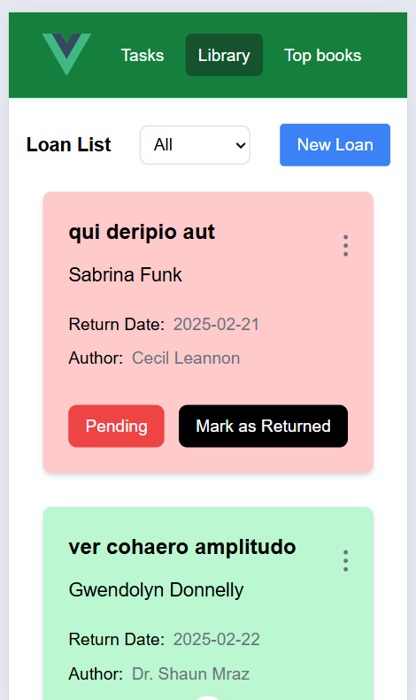

# Frontend
### Tech Stack
- Vue 3
- axios
- tailwindcss

### Features
- Home
  <br/>
  
- Add task
  <br/>
  
- Edit task
  <br/>
  
- Delete task
  <br/>
   
- Filter task
  <br/>
  
- responsive design
  <br/>
  

## Project Setup

```sh
npm install
```

### Compile and Hot-Reload for Development

```sh
npm run dev
```

### Compile and Minify for Production

```sh
npm run build
```
